# Motivation and overview

Permissive open-source licenses have been a great benefit for the IT industry:
Most common problems can be addressed using high-quality libraries under
permissive licenses (such as BSD or Apache) which can be easily re-used and
integrated.

This has been great for everybody.

Nevertheless, statically linking third-party code requires special care:
Vulnerabilities in third-party code are discovered regularly, and this implies
updating your binaries. Things get harder when changes in upstream libraries
need to be merged into local forks of the code. Not all organisations get this
right, and even companies with mature secure development processes fumble
sometimes.

For the reverse engineer and offensive researcher, identifying vulnerable
statically linked software libraries is both an opportunity and a challenge:

 * An **opportunity** since it can provide a way to obtain a vulnerability in a
target without having to do the hard work of identifying a new one.
 * A **challenge** since the available tooling for performing this task is
exceptionally poor: The standard way is usually a combination of “searching for
known strings”, “educated guess”, and sometimes the use of
[BinDiff](https://www.zynamics.com/software.html) (a tool that
was designed for a very different purpose).

The technical problem can be phrased as “efficiently performing a fuzzy search
into a relatively large space of possible functions”. Fuzzy search is a
requirement because compiler differences, optimization changes, and code changes
contribute to add “noise” to the code in question.

On the side of academic research, several interesting papers
([CCS ‘16](http://www.cs.ucr.edu/~heng/pubs/genius-ccs16.pdf),
[CCS ‘17](https://arxiv.org/pdf/1708.06525.pdf)
have proposed sophisticated machine-learning-based methods to combine code
embeddings with approximate nearest neighbor searches. They calculate a
representation of code in R^n, and then search for nearby points to identify
good candidates. While these approaches look powerful and sophisticated, public
implementations do not exist, and adoption among practitioners has not happened.
On the practical side, real-world use has been derived from CFG-focused
algorithms such as
[MACHOC](https://github.com/ANSSI-FR/polichombr/blob/dev/docs/MACHOC_HASH.md) -
but with the downside of being not tolerant to
structural changes and not allowing for any “learning” of distances. Recently at
([SSTIC ‘18](https://www.sstic.org/2018/presentation/yadiff/))
a neural-network based approach has been presented, with an announcement of
making the code available in the next months.

This file describes
[FunctionSimSearch](https://github.com/google/functionsimsearch) - an
Apache-licensed C++ toolkit with Python bindings which provides three things:

 1. An efficient implementation of a hash function (based on SimHashing) which
calculates a 128-bit hash from disassembled functions - and which preserves
similarity (e.g. “distance” of two functions can be calculated by simply
calculating the hamming distance between two hashes - which translates to two
XOR and two POPCNT instructions on x64).
 2. An efficient search index to allow approximate nearest neighbor search for
 128-bit hashes.
 3. Some supervised machine learning code that can be used to “learn” a good
 hash function from human-provided examples - given a set of functions that
 should be similar according to the hash, and a set of functions that should be
 dissimilar, the code learns a hash function that attempts to respect these
 examples.

## The need for good fuzzy matching.

Every reverse engineer has encountered that different compilers and compiler
settings can generate drastically different pieces of assembly. Compilers can
alter the CFG significantly, move code around, and even when they do not inline
aggressively or unroll loops, decisions about code duplication, instruction
movement and scheduling etc. lead to very different disassemblies:

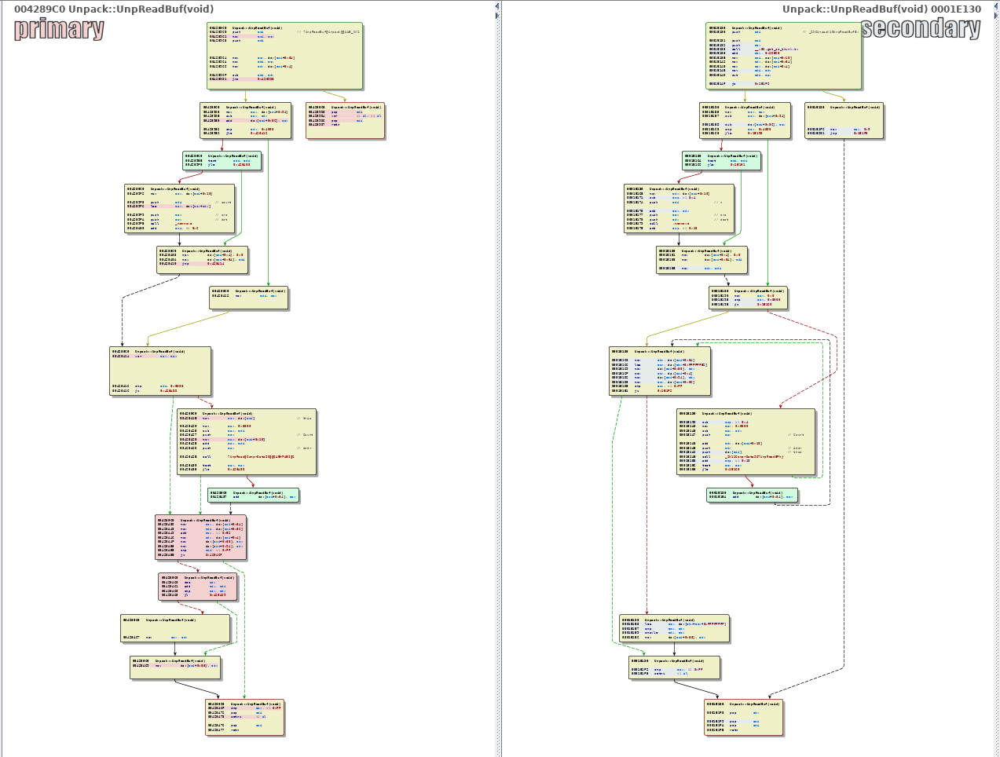
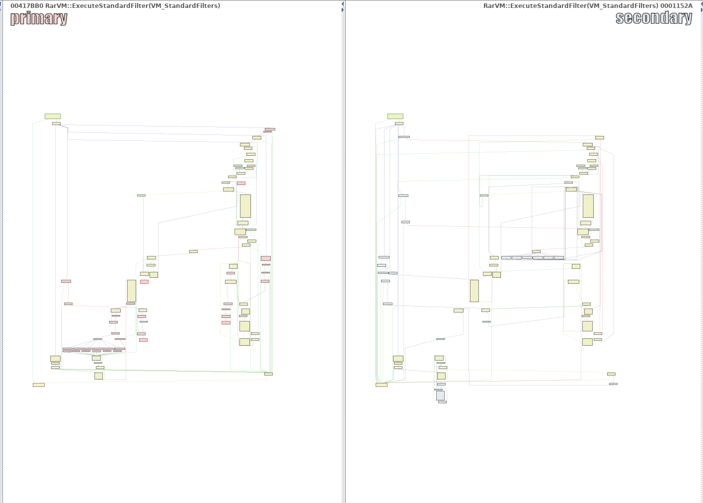

It is obvious that a good method to identify a function in the presence of
changes is needed, and that both instruction-level and graph-level changes need
to be dealt with.

## Understanding the SimHash algorithm and what it provides.
SimHashing was introduced in a paper by Moses Charikar, originally in the
context of web page de-duplication. It is part of a family of algorithms and
concepts called “locality-sensitive hashing”; a concept we will return to later.

The algorithm itself helps condense a set into a hash, with the property that
the Hamming distance between the two hashes approximates the set similarity
between the original sets.

Given an input set of features (which themselves are random 128-bit vectors,
obtained through hashing), calculate a final hash value as follows:

1. Initialize a vector of 128 floating-point values to all zeroes.
2. For each feature in the input set, do:
  a. If bit n of the feature is 0, subtract 1 from the n-th floating-point value
  b. If bit n of the feature is 1, add 1 to the n-th floating point value
3. Convert the vector of floats to a 128-bit vector by mapping positive values
to 1, negative values to 0.

Why does this produce a similarity-preserving hash? The intuition can be
obtained by imagining what a minor change in the input set would do to the
vector of floats: The values of these vectors will be approximately normally
distributed with mean 0 and variance 1/4 times the number of features:

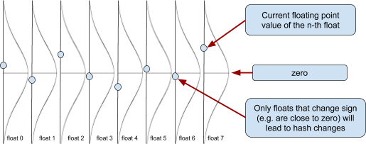

Some of the floats will be close to zero, either negative or positive. By
changing the sets slightly (adding or removing a few features), there is some
probability of individual floats crossing over from positive into negative
territory or vice versa. This probability goes up as more of the set changes;
for small changes, the odds of many bits flipping is comparatively low.

What is a good set of input features for our comparison? Ideally we would want
to extract features that are representative of what we deem “similar”; e.g. two
functions that are compiled from the same source code should have similar
(overlapping) sets of features. It is somewhat involved to algorithmically
design such features, so for the moment, the features in question are extremely
simple: Subgraphs of the control-flow graph, and n-grams of mnemonics of
disassembled instructions. In a naive implementation, all features have unit
weight - e.g. every feature contributes the same to the final hash. This is
clearly not ideal - a function prologue is not very indicative of the similarity
between two functions - and we will improve this later in this post. Other
non-implemented ideas for more features will be discussed at the end of the
document.

## A simple approximate nearest-neighbor search for hashes
With a way of calculating a similarity-preserving hash for a given input
function, how do we search non-trivially sized corpora of such hashes for the
"most similar" hash?

The answer lies in a second application of locality-sensitive hashing. If one
can construct a family of hash functions so that the probability of two nearby
points getting hashed into the same hash bucket is higher than the probability
of two distant points getting hashed into the same bucket, one can construct a
relatively efficient nearest-neighbor search: Simply use k different hash
functions of the family to map inputs to buckets of candidates and process the
candidates.

## Choosing random bits as locality-sensitive hashes
Since our inputs are bit vectors, the easiest way to build such a hash function
is to simply subsample bits from the vector. This has the nice property that a
single random bit-level permutation of the input is enough to construct a hash
family: In order to construct k different hashes, apply the bit-level
permutation k times to your input and take the first few bits. Bitwise
permutations on 128 bits are cheap-ish in software and close to free in
hardware; the permutation chosen in the codebase should execute in ~65 cycles on
a modern CPU.

## Choice of data structures
The underlying data structure is an ordered collection of tuples of the form: 

     `<PermutationIndex, k-th-permutation-of-input-hash, result-id>`


Performing a binary search using the tuple
`<k, perm_k(input) & (0xFFL << 56), 0>` will give us the hash bucket for a given
permutation index and input value. We perform k such searches, and for each hash
bucket we add all elements to a candidate list. The hamming distance between
each candidate and the input hash is calculated, and the results can be returned
in the order of their hamming distance.

A maximally memory- and cache-efficient version of this would simply use a
sorted flat array / vector of such tuples; for our purposes (and for efficient
insertion) the existing C++ code uses the equivalent of a std::set container,
made persistent using a memory-mapped file as storage. For a production-level
deployment with vastly more reads than inserts, the sorted vector will almost
certainly perform better.

## Learning a SimHash from examples
One of the problems with the described approach can immediately be identified:
Every feature in the input set is treated with equal importance. In reality,
though, features have vastly different importance. Luckily, it is easy to
incorporate the importance of individual features into the calculation of a
SimHash: Instead of adding +1 or -1 into the vector of floats, one could add or
subtract a feature-specific weight.

But how does one infer good weights from the training data? Can we automatically
"learn" what features will be preserved across compiler changes, with some
predictive power?

## Using the cheap gradient principle
The workhorse of modern machine learning is automatic differentiation. In simple
terms, automatic differentiation provides the "cheap gradient principle" --
which can be paraphrased as “if you can calculate a function from R^n to R, you
can calculate the gradient of this function with moderate overhead”. This means
that if we can specify a loss function involving our weights, we can try to
minimize this loss function. While we won’t have any guarantees of convergence,
odds are we can learn weights from examples.

So what we need is a bunch of labelled data (ideally pairs of functions labelled
"same" or "not the same"), and a good loss function.

## Choosing a loss function for the SimHash distance
Building a loss function for our distance requires a slight bit of care. Since
our final distance is a Hamming distance between two bit vectors, the gradient
of this distance is likely to be zero - stepwise functions have many "flat
sections" for which we cannot get a useful gradient.

The simplest idea would be to remove the last step of the hash calculation -
instead of comparing the hashes that we derive from the vector-of-floats, one
could measure the Euclidian distance on the final vectors-of-floats.
Unfortunately, this creates "perverse incentives" for the optimizer: The simplest
way to make two “similar” functions close to each other would be to shrink
weights that occur in both to zero.

So ideally we want something that “penalizes” when pairs of similar functions
with large distance and pairs of dissimilar functions with low distance.

We need a function that is positive when two real values do not have the same
sign, and zero (or negative) if the two real values that have the same sign.
Ideally, it should also provide a slope / incentive to move inputs in the
direction of "same sign".

We start with a simple smoothed step function 


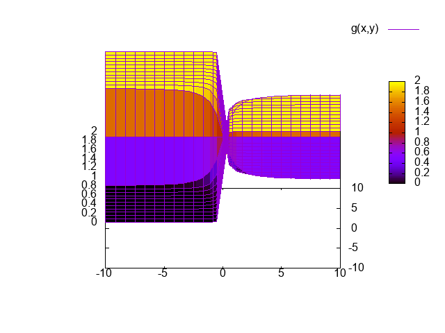

This function has high loss when the sign of x and y is different, and zero loss
when it is the same. Unfortunately, it is also flat on most of the surface, and
we need to somehow skew the flat regions to point into the right direction.
We multiply with


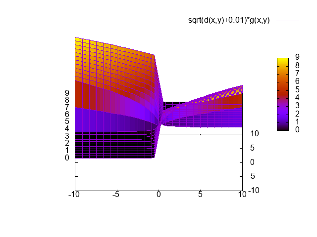

This function satisfies our requirements: It provides a way to move parameters
in the desired direction, punishes unequal signs, and has zero loss if x and y
have equal sign.

In summary: For a given pair of real vectors (each obtained by calculating the
hash function without the last step of converting to a binary hash) we can
simply sum the loss for each vector entry. We now have a loss function that we
can use to adjust our parameters from examples.

## Generating training data
Generating training data should - at least in theory - be simple. It should be
sufficient to compile some open-source code with a number of different compilers
and compiler settings, and then parse the symbol information to create groups of
"function variants" - e.g. multiple different compiler outputs for the same
C/C++ function. Similarly, known-dissimilar-pairs matches can be generated by
simply taking two random functions with different symbols.

Unfortunately, theory is not practice, and a number of grimy implementation
issues come up, mostly around symbol parsing and CFG reconstruction.

### Real-world problems: Symbols
One problem arises from the non-availability of good cross-platform tooling for
parsing different versions of the PDB file format - which naturally arise when
many different versions of Visual Studio are used - and the difficulty of
reliably building the same open-source codebase for many different compilers.
While GCC and CLANG are often drop-in-replaceable, projects that build without
intervention on both Visual Studio, GCC, and CLANG are much more rare.

The (unfortunate) solution to the PDB parsing issue is “giving up” - the
codebase expects the PDB information to have been dumped to a text file. More on
this below.

The (unfortunate) solution to the issue of building the same codebase reliably
with Visual Studio and GCC is also “giving up” - it is up to the user of
FunctionSimSearch to get things built.

Other problems arise by different mangling conventions for C++ code, and
different conventions in different compilers affecting how exactly a function is
named. This is solved by a hackish small tool that removes type information
from symbols and tries to "unify" between GCC/CLANG and Visual Studio notation.

### Real-world problems: Reliably generating CFGs, and polluted data sets
Obtaining CFGs for functions should be simple. In practice, none of the tested
disassemblers correctly disassembles switch statements across different
compilers and platforms: Functions get truncated, basic blocks mis-assigned etc.
The results particularly dire for GCC binaries compiled using -fPIC of -fPIE,
which, due to ASLR, is the default on modern Linux systems.

A particular problem that arose in testing was that most disassemblers fail to
recognize that a failed stack cookie check issues a "call" that will not return;
this leads to many functions being lumped into one CFG.

The net result is polluted training data and polluted search indices, leading to
false positives, false negatives, and general frustration for the practitioner.
While the ideal fix would be more reliable disassembly, in practice the fix is
careful investigation of extreme size discrepancies between functions that
should be the same, and ensuring that training examples are compiled without
PIC and PIE (-fno-pie -fno-PIE -fno-pic -fno-PIC is a useful set of build flags).

## Data generation in practice
In practice, training data can be generated by doing:

```bash
cd ./testdata
./generate_training_data.py --work_directory=/mnt/training_data
```

The script parse all ELF and PE files it can find in the ./testdata/ELF and ./testdata/PE directories. For ELF files with DWARF debug information, it uses objdump to extract the names of the relevant functions. For PE files, I was unfortunately unable to find a good and reliable way of parsing a wide variety of PDB files from Linux. As a result, the script expects a text file with the format “<executable_filename>.debugdump” to be in the same directory as each PE executable. This text file is expected to contain the output of the DIA2Dump sample file that ships with Visual Studio.

The format of the generated data is as follows:

```
./extracted_symbols_<EXEID>.txt
./functions_<EXEID>.txt
./[training|validation]_data_[seen|unseen]/attract.txt
./[training|validation]_data_[seen|unseen]/repulse.txt
./[training|validation]_data_[seen|unseen]/functions.txt
```

Let’s walk through these files to understand what we are operating on:

1. The `./extracted_symbols_<EXEID>.txt` files:
Every executable is assigned an executable ID - simply the first 64 bit of it’s
SHA256. Each such file describes the functions in the executable for which
symbols are available, in the format:
```
[exe ID] [exe path] [function address] [base64 encoded symbol] false
```

2. The `./functions_<EXEID>.txt` files:
These files contain the hashes of the extracted features for each function in the
executable in question. The format of these files is:
```
[exe ID]:[function address] [sequence of 128-bit hashes per feature]
```
3. The `./[training|validation]_data_[seen|unseen]/attract.txt` and `./repulse.txt` files:
These files contain pairs of functions that should repulse / attract, the format is simply
```
[exe ID]:[function address] [exe ID]:[function address]
```
4. The `./[training|validation]_data_[seen|unseen]/functions.txt` files:
A file in the same format as the `./functions_<EXEID>.txt` files with just the 
functions referenced in the corresponding `attract.txt` and `repulse.txt`.


### Two ways of splitting the training / validation data
What are the mysterious `training_data_seen` and `training_data_unseen` directories?
Why does the code generate multiple different training/validation splits? The 
reason for this is that there are two separate questions we are interested in:

1. Does the learning process improve our ability to detect variants of a
function we have trained on?
2. Does the learning process improve our ability to detect variants of a
function, even if no version of that function was available at training time?

While (2) would be desirable, it is unlikely that we can achieve this goal. For
our purposes (detection of statically linked vulnerable libraries), we can
probably live with (1). But in order to answer these questions meaningfully, we
need to split our training and validation data differently.

If we wish to check for (2), we need to split our training and validation data
along “function group” lines: A “function group” being a set of variant
implementations of the same function. We then need to split off a few function
groups, train on the others, and use the groups we split off to validate.

On the other hand, if we wish to check for (1), we need to split away random
variants of functions, train on the remainder, and then see if we got better at
detecting the split-off functions.

The differences in how the training data is split is best illustrated as follows:

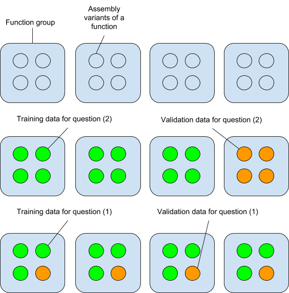


### Implementation issues of the training
The industry-standard approach for performing machine learning are libraries
such as TensorFlow or specialized languages such as Julia with AutoDiff packages.
These come with many advantages -- most importantly, automated parallelization
and offloading of computation to your GPU.

Unfortunately, I am very stubborn -- I wanted to work in C++, and I wanted to
keep the dependencies extremely limited; I also wanted to specify my loss
function directly in C++. As a result, I chose to use a C++ library called SPII
which allows a developer to take an arbitrary C++ function and minimize it.
While this offers a very clean and nice programming model, the downside is
"CPU-only" training. This works, but is uncomfortably slow, and should probably
be replaced with a GPU-based version.

### Running the actual training process
Once the training data is available, running the training process is pretty straightforward:

```bash
thomasdullien@machine-learning-training:~/sources/functionsimsearch/bin$ ./trainsimhashweights -data=/mnt/training_data/training_data_seen/ --weights=weights_seen.txt
[!] Parsing training data.
[!] Mapping functions.txt
[!] About to count the entire feature set.
[!] Parsed 1000 lines, saw 62601 features ...
[!] Parsed 2000 lines, saw 104280 features ...
(...)
[!] Parsed 12000 lines, saw 270579 features ...
[!] Processed 12268 lines, total features are 271653
[!] Iterating over input data for the 2nd time.
[!] Loaded 12268 functions (271653 unique features)
[!] Attraction-Set: 218460 pairs
[!] Repulsion-Set: 218460 pairs
[!] Training data parsed, beginning the training process.
Itr       f       deltaf   max|g_i|   alpha      H0       rho
   0 +7.121e+04       nan 4.981e+02 2.991e-06 1.000e+00 0.000e+00
   1 +7.119e+04 2.142e+01 5.058e+02 1.000e+00 1.791e-06 3.114e-01
   2 +7.101e+04 1.792e+02 3.188e+02 1.000e+00 2.608e-05 5.735e-03
   3 +7.080e+04 2.087e+02 2.518e+02 1.000e+00 4.152e-05 4.237e-03
   4 +7.057e+04 2.271e+02 2.757e+02 1.000e+00 5.517e-05 4.469e-03
    ...
```

A few days later, the training process will have performed 500 iterations of
L-BFGS while writing snapshots of the training results every 20 steps into our
current directory (`20.snapshot, ..., 480.snapshot`). We can evaluate the results of our training:

```bash
$ for i in *.snapshot; do foo=$(./evalsimhashweights --data /mnt/june2/validation_data_seen/ --weights $i | grep \(trained\)); echo $i $foo; done
```
This provides us with the "difference in average distance between similar and
dissimilar pairs" in the validation data: the code calculates the average
distance between similar pairs and between dissimilar pairs in the validation
data, and shows us the difference between the two. If our training works, the
difference should go up.

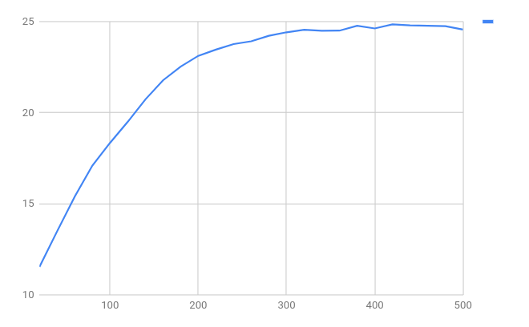

We can see that somewhere around 420 training steps we begin to over-train - our
difference-of-means on the validation set starts inching down again - so it is a
good idea to stop the optimization process. We can also see that the
difference-in-average-distance between the “similar” and “dissimilar” pairs has
gone up from a bit more than 10 bits to almost 25 bits - this seems to imply
that our training process is improving our ability to recognize variants of
functions that we are training on.

### Understanding the results of training
There are multiple ways of understanding the results of the training procedure:

Given that we can easily calculate distance matrices for a set of functions, and
given that there are popular ways of visualizing high-dimensional distances
(t-SNE and MDS), we can see the effects of our training visually.

Several performance metrics exist for information-retrieval tasks
(Area-under-ROC-curve AUC).
Nothing builds confidence like understanding, and since we obtain per-feature
weights, we can manually inspect the feature weights and features to see what
exactly the learning algorithm learnt.

The next sections are dedicated to go through these steps.


## Using t-SNE as visualisation
A common method to visualize high-dimensional data from pairwise distances is
t-SNE -- a method that ingests a matrix of distances and attempts to create a
low-dimensional (2d or 3d) embedding of these points that attempts to respect
distances. The code comes with a small Python script that can be used to
visualize subsets of the search index.

We will create two search indices: One populated with the “learnt feature
weights”, and one populated with the “unit feature weight”:

```bash
# Create and populate an index with the ELF unrar samples with the
# learnt features.
./createfunctionindex --index=learnt_features.index; ./growfunctionindex --index=learnt_features.index --size_to_grow=256; for i in $(ls ../testdata/ELF/unrar.5.5.3.builds/*); do echo $i; ./addfunctionstoindex --weights=420.snapshot --index=learnt_features.index --format=ELF --input=$i; done
# Add the PE files
for i in $(find ../testdata/PE/ -iname *.exe); do echo $i;
./addfunctionstoindex --weights=420.snapshot --index=learnt_features.index --format=PE --input=$i; done

# Create and populate an index with unit weight features.
./createfunctionindex --index=unit_features.index; ./growfunctionindex --index=unit_features.index --size_to_grow=256; for i in $(ls ../testdata/ELF/unrar.5.5.3.builds/*); do echo $i; ./addfunctionstoindex --index=unit_features.index --format=ELF --input=$i; done
# Add the PE files
for i in $(find ../testdata/PE/ -iname *.exe); do echo $i;
./addfunctionstoindex --index=unit_features.index --format=PE --input=$i; done

# Dump the contents of the search index into a text file.
./dumpfunctionindex --index=learnt_features.index > learnt_index.txt
./dumpfunctionindex --index=unit_features.index > unit_index.txt

# Process the training data to create a single text file with symbols for
# all functions in the index.
cat /mnt/training_data/extracted_*.txt > ./symbols.txt

# Generate the visualisation
cd ../testdata
./plot_function_groups.py  ../bin/symbols.txt ../bin/unit_index.txt /tmp/unit_features.html
./plot_function_groups.py  ../bin/symbols.txt ../bin/learnt_index.txt /tmp/learnt_features.html
```

We now have two HTML files that use d3.js to render the results:

 * [Unit Feature Weights Visualisation](http://htmlpreview.github.io/?https://github.com/googleprojectzero/functionsimsearch/blob/master/doc/unit_features.html)
 * [Learnt Feature Weights Visualisation](http://htmlpreview.github.io/?https://github.com/googleprojectzero/functionsimsearch/blob/master/doc/learnt_features.html)

Mouse-over on a point will display the function symbol and file-of-origin.
It is visible to the naked eye that our training had the effect of moving groups
of functions “more closely together”.

We can see here that the training does have some effect, but does not produce
the same good effect for all functions: Some functions seem to benefit much more
from the training than others, and it remains to be investigated why this is the
case.

## Examining TPR, FPR, IRR, and the ROC-curve

When evaluating information retrieval systems, various metrics are important:
The true positive rate (how many of the results we were
supposed to find did we find?), the false positive rate (how many of the results
we were not supposed to find did we find?), the irrelevant result rate (what
percentage of the results we returned were irrelevant? This is the complement
to the [precision](https://en.wikipedia.org/wiki/Precision_and_recall#Definition_(information_retrieval_context))),
and the the [ROC curve](https://en.wikipedia.org/wiki/Receiver_operating_characteristic) (a plot
of the TPR against the FPR).

This is helpful in both making informed choices about the right distance
threshold, but also in order to quantify how much we are losing by performing
approximate vs. precise search. It also helps us choose how many "hash buckets"
we want to use for approximate searching.

There is a Python script in the git repository that can be used to generate the
data for the ROC curve. The script requires a file with the symbols for all
elements of the search index, a textual representation of the search index
(obtained with ```dumpsearchindex```, and access to the actual search index file.

```
# Create a search index to work with.
./createfunctionindex --index=/media/thomasdullien/roc/search.index
# Make it big enough to contain the data we are adding.
./growfunctionindex --index=/media/thomasdullien/roc/search.index --size_to_grow=1024
# Add all the functions from our training directories to it:
for filename in $(find ../testdata/ELF/ -iname *.ELF); do echo $filename; ./addfunctionstoindex --format=ELF --input=$filename --index=/media/thomasdullien/roc/search.index; done
for filename in $(find ../testdata/PE/ -iname *.exe); do echo $filename; ./addfunctionstoindex --format=PE --input=$filename --index=/media/thomasdullien/roc/search.index; done
# Now dump the search index into textual form for the Python script:
./dumpfunctionindex --index /media/thomasdullien/roc/search.index  > /media/thomasdullien/roc/search.index.txt
# The file "symbols.txt" is just a concatenation of the symbols extracted during
# the run of the ./generate_training_data.py script.
cat /media/thomasdullien/training_data/extracted_symbols_*.txt > /media/thomasdullien/roc/symbols.txt
```

In order to obtain the data for the curve, we can use the following Python script:

```
testdata/evaluate_ROC_curve.py --symbols=/media/thomasdullien/roc/symbols.txt --dbdump=/media/thomasdullien/roc/search.index.txt --index=/media/thomasdullien/roc/search.index
```

The output of the script is a 7-column output:
1. The maximum distance between two SimHash values to consider.
2. The true positive rate for exact (non-approximate-search-index) search.
3. The false positive rate for exact (non-approximate-search-index) search.
4. The true positive rate for search using the approximate search index.
5. The false positive rate for using the approximate search index.
6. The percentage of irrelevant results returned using exact search.
7. The percentage of irrelevant results returned using approximate search.

We can generate the curves for both the trained and untrained data, and then
plot the results using gnuplot:

```
gnuplot -c ./testdata/plot_results_of_evaluate_ROC_curve.gnuplot ./untrained_roc.txt
gnuplot -c ./testdata/tpr_fpr_curve.gnuplot ./untrained_roc.txt ./trained_roc.txt
```

So let's examine this plots for the untrained results first:

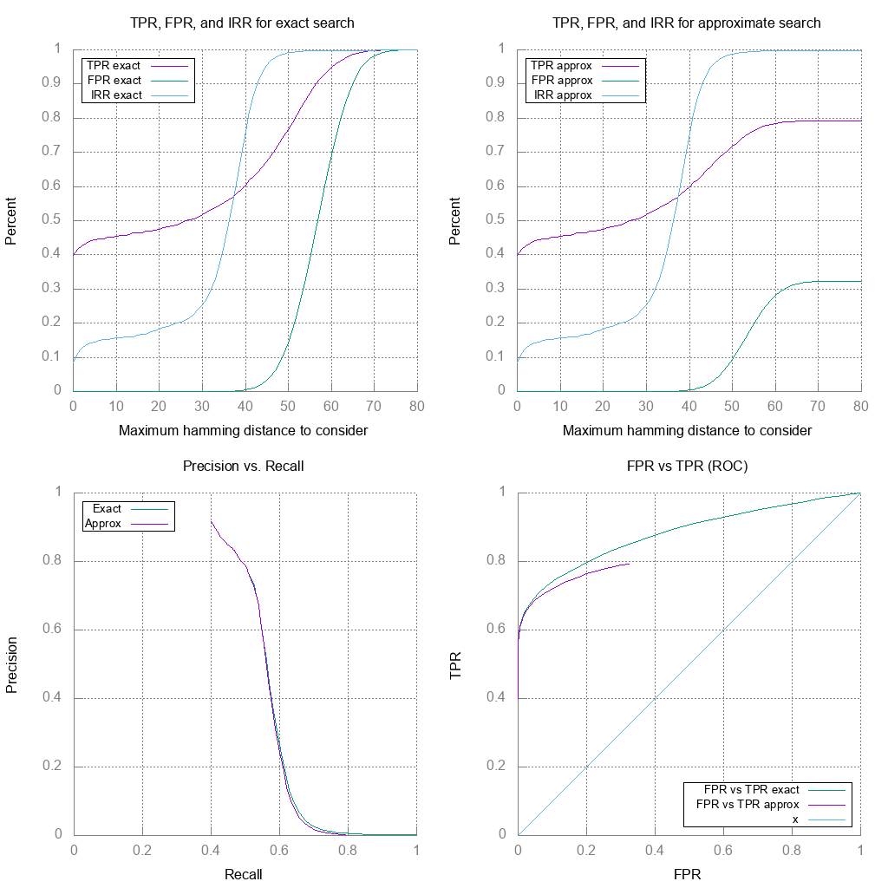

The first diagram shows that if we want a TPR of more than 50%, we will have
to incur about 20% of the returned results being irrelevant to our search; the
cut-off distance we should take for this is somewhere around 25 bits.

We also see that we will pay a heavy price for increasing the cut-off: At 35
bits, where our TPR hits 55%, **half of our results are irrelevant**. This is
a weakness of the set-up at the moment, and we will see if it can be improved
by learning weights.

The second diagram shows that we only pay in TPR for the approximate search for
very high cut-offs - the TPR and FPR flatten off, which is a symptom of us
missing more and more of the search space as we expand the number of bits we
consider relevant.

The lower-left diagram shows how quickly our precision deteriorates as we try
to improve the recall.

How are these curves affected by the training process?

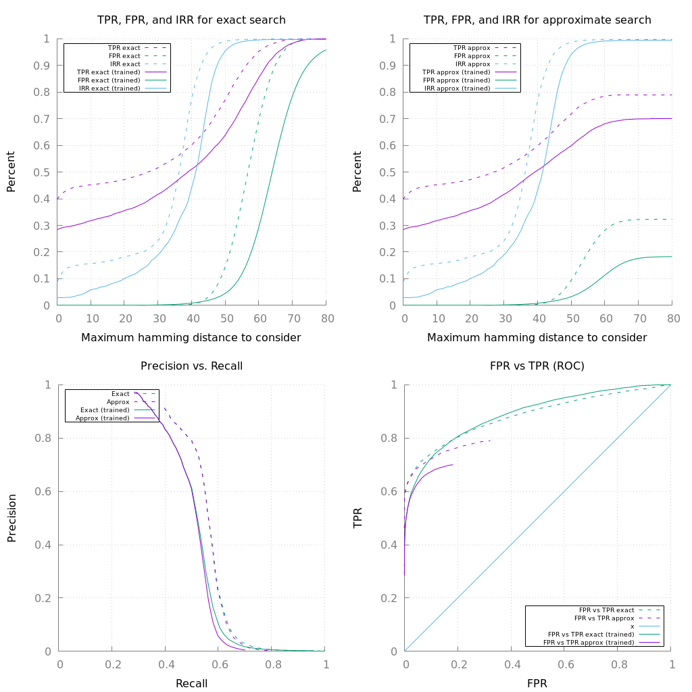

So in the top-left curve, we can see that the rate of irrelevant results at 10
bits distance has dropped significantly: Down to approximately 5% from about
15%. Unfortunately, the true-positive-rate has also dropped - instead of about
45% of the results we want to get, we only achieve about 33%. So the training
works in the sense that it improves the ratio of good results to irrelevant
results significantly, but at the cost of lowering the overall rate of results
that we find.

If we are willing to tolerate approximately 15% irrelevant results, we will get
about 45% of the results we desire in the non-trained version. Sadly, in the
trained version, for the same level of irrelevant results, we only get about
40% of the results we desire.

In summary: In the current form, the training is useful for lowering the
irrelevant result rate below what is achieveable without training - but for any
acceptable rate of irrelevant results that can be achieved without training, the
untrained version appears to achieve better results.

## Do we generalize to out-of-sample functions?

In the section about splitting our training/validation data, we posed two
questions - and the more interesting question is (2). Is there anything we are
learning about the *compilers* ?

Plotting the difference-in-mean-distance that we plotted for question (1) also
for question (2) yields the following image:

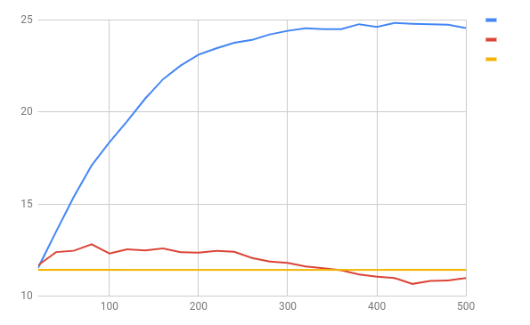

The red curve implies that there is a faint but non-zero signal - after about 80
training steps we have increased the mean-difference-in-means from 11.42 bits
to 12.81 bits; overtraining appears to begin shortly thereafter.

It is unclear how much signal could be extracted using more powerful models; the
fact that our super-simple linear model extracts *something* is encouraging.

## Practical searching:

### Searching for unrar code in mpengine.dll

As a first use case, we will use IDA to populate a search index with
symbols from unrar, and then search through mpengine.dll (also
from Binary Ninja) for any functions that we may recognize.

We can populate a search index called '''/var/tmp/ida2/simhash.index''' from
a set of existing disassemblies using the following command line:

```bash
# Create the file for the search index.
/home/thomasdullien/Desktop/sources/functionsimsearch/bin/createfunctionindex --index=/var/tmp/ida2/simhash.index
# Populate using all 32-bit UnRAR.idb in a given directory.
for i in $(find /media/thomasdullien/unrar.4.2.4.builds.idbs/unrar/ -iname UnRAR.idb); do ./ida -S"/usr/local/google/home/thomasdullien/sources/functionsimsearch/pybindings/ida_example.py export /var/tmp/ida2/" $i; done
# Populate using all 64-bit UnRAR.i64 in a given directory.
for i in $(find /media/thomasdullien/unrar.4.2.4.builds.idbs/unrar/ -iname UnRAR.i64); do ./ida64 -S"/usr/local/google/home/thomasdullien/sources/functionsimsearch/pybindings/ida_example.py export /var/tmp/ida2/" $i; done```
```

Once this is done, we can open mpengine.dll in IDA, go to File->Script File and
load ```ida_example.py```, then hit "Shift-M".

The IDA message window will get flooded with results like the text below:
```
(...)
6f4466b67afdbf73:5a6c8da1 f3f964313d8c559e-e6196c17e6c230b4 Result is 125.000000 - 72244a754ba4796d:42da24 x:\shared_win\library_sources\unrar\unrarsrc-4.2.4\unrar\build.VS2015\unrar32\Release\UnRAR.exe 'memcpy_s' (1 in inf searches)
6f4466b67afdbf73:5a6c8da1 f3f964313d8c559e-e6196c17e6c230b4 Result is 125.000000 - ce2a2aa885d1a212:428234 x:\shared_win\library_sources\unrar\unrarsrc-4.2.4\unrar\build.VS2015\unrar32\MinSize\UnRAR.exe 'memcpy_s' (1 in inf searches)
6f4466b67afdbf73:5a6c8da1 f3f964313d8c559e-e6196c17e6c230b4 Result is 125.000000 - 69c2ca5e6cb8a281:42da88 x:\shared_win\library_sources\unrar\unrarsrc-4.2.4\unrar\build.VS2015\unrar32\FullOpt\UnRAR.exe 'memcpy_s' (1 in inf searches)
--------------------------------------
6f4466b67afdbf73:5a6f7dee e6af83501a8eedd8-6cdba61793e9a840 Result is 108.000000 - ce2a2aa885d1a212:419301 x:\shared_win\library_sources\unrar\unrarsrc-4.2.4\unrar\build.VS2015\unrar32\MinSize\UnRAR.exe '?RestartModelRare@ModelPPM@@AAEXXZ' (1 in 12105083908.189119 searches)
6f4466b67afdbf73:5a6f7dee e6af83501a8eedd8-6cdba61793e9a840 Result is 107.000000 - 86bc6fc88e1453e8:41994b x:\shared_win\library_sources\unrar\unrarsrc-4.2.4\unrar\build.VS2013\unrar32\MinSize\UnRAR.exe '?RestartModelRare@ModelPPM@@AAEXXZ' (1 in 3026270977.047280 searches)
6f4466b67afdbf73:5a6f7dee e6af83501a8eedd8-6cdba61793e9a840 Result is 107.000000 - eb42e1fc45b05c7e:417030 x:\shared_win\library_sources\unrar\unrarsrc-4.2.4\unrar\build.VS2010\unrar32\MinSize\UnRAR.exe '?RestartModelRare@ModelPPM@@AAEXXZ' (1 in 3026270977.047280 searches)
--------------------------------------
6f4466b67afdbf73:5a6fa46b f0b5a76c7eee2882-62d6c234a16c5b68 Result is 106.000000 - d4f4aa5dd49097be:414580 x:\shared_win\library_sources\unrar\unrarsrc-4.2.4\unrar\build.VS2010\unrar32\Release\UnRAR.exe '?Execute@RarVM@@QAEXPAUVM_PreparedProgram@@@Z' (1 in 784038800.726675 searches)
6f4466b67afdbf73:5a6fa46b f0b5a76c7eee2882-62d6c234a16c5b68 Result is 106.000000 - 50bbba3fc643b153:4145c0 x:\shared_win\library_sources\unrar\unrarsrc-4.2.4\unrar\build.VS2010\unrar32\FullOpt\UnRAR.exe '?Execute@RarVM@@QAEXPAUVM_PreparedProgram@@@Z' (1 in 784038800.726675 searches)
6f4466b67afdbf73:5a6fa46b f0b5a76c7eee2882-62d6c234a16c5b68 Result is 105.000000 - eb42e1fc45b05c7e:410717 x:\shared_win\library_sources\unrar\unrarsrc-4.2.4\unrar\build.VS2010\unrar32\MinSize\UnRAR.exe '?Execute@RarVM@@QAEXPAUVM_PreparedProgram@@@Z' (1 in 209474446.235050 searches)
--------------------------------------
6f4466b67afdbf73:5a6fa59a c0ddbe744a832340-d7d062fe42fd5a60 Result is 106.000000 - eb42e1fc45b05c7e:40fd39 x:\shared_win\library_sources\unrar\unrarsrc-4.2.4\unrar\build.VS2010\unrar32\MinSize\UnRAR.exe '?ExecuteCode@RarVM@@AAE_NPAUVM_PreparedCommand@@I@Z' (1 in 784038800.726675 searches)
--------------------------------------
6f4466b67afdbf73:5a7ac980 c03968c6fad84480-2b8a2911b1ba1e40 Result is 105.000000 - 17052ba379b56077:140069170 x:\shared_win\library_sources\unrar\unrarsrc-4.2.4\unrar\build.VS2015\unrar64\Debug\UnRAR.exe 'strrchr' (1 in 209474446.235050 searches)
6f4466b67afdbf73:5a7ac980 c03968c6fad84480-2b8a2911b1ba1e40 Result is 105.000000 - 4e07df225c1cf59c:140064590 x:\shared_win\library_sources\unrar\unrarsrc-4.2.4\unrar\build.VS2013\unrar64\Debug\UnRAR.exe 'strrchr' (1 in 209474446.235050 searches)
6f4466b67afdbf73:5a7ac980 c03968c6fad84480-2b8a2911b1ba1e40 Result is 105.000000 - a754eed77d0059ed:1400638f0 x:\shared_win\library_sources\unrar\unrarsrc-4.2.4\unrar\build.VS2012\unrar64\Debug\UnRAR.exe 'strrchr' (1 in 209474446.235050 searches)
--------------------------------------
```
Let's examine some of these results a bit more in-depth. The first result claims
to have found a version of ```memcpy_s```, with a 125 out of 128 bits matching.
This implies a very close match. Let's look at the corresponding disassemblies:

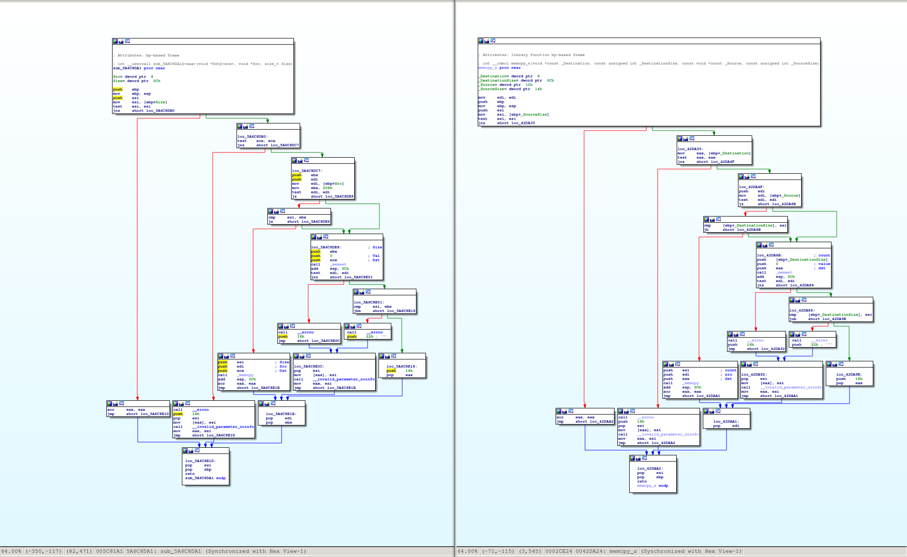

Aside from a few minor changes on the instruction-level, the two functions are
clearly the same - even the CFG structure stayed identical.

The next result claims to have found a variant ```ppmii::ModelPPM::RestartModelRare``` with 108 of the 128 bits matching. 

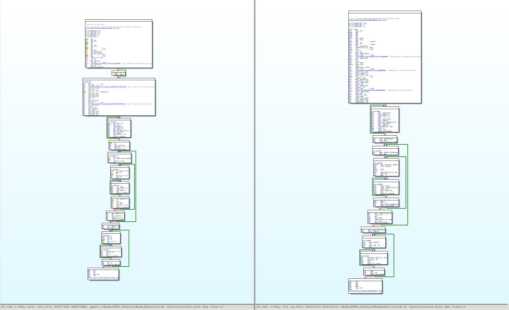
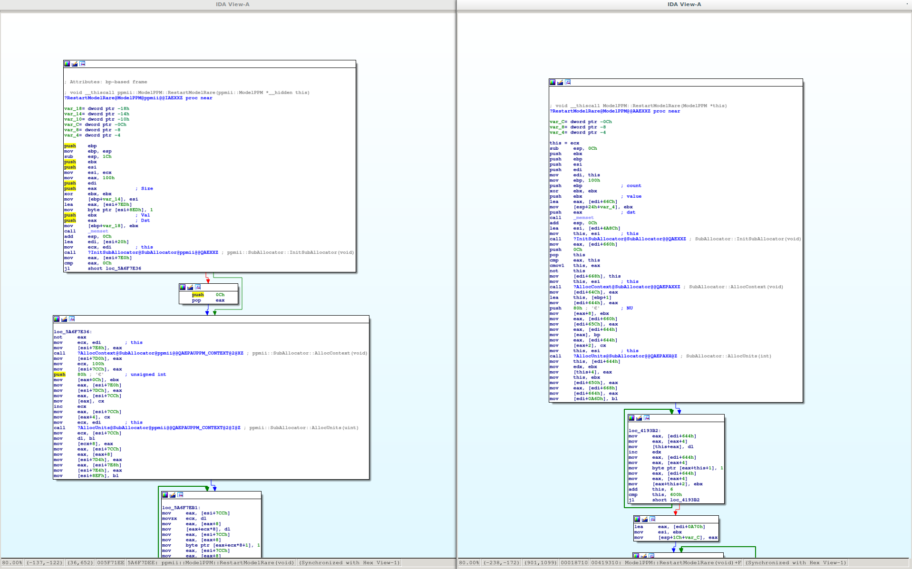

The disassembly (and all structure offsets in the code) seems to have changed
quite a bit, but the overall CFG structure is mostly intact: The first large
basic block was broken up by the compiler, so the graphs are not identical, but
they are definitely still highly similar.


The next example is a much larger function - the result claims to have
identified ```RarVM::ExecuteCode``` with 106 of 128 bits of the hash matching.
What does the graph and the disassembly look like?


In this example, the graph has changed substantially, but a few subgraphs seem
to have remained stable. Furthermore, the code contains magic constants (such
as 0x17D7840, or the 0x36) that will have factored into the overall hash. This
is a nontrivial find, so ... yay!

This presentation would not be complete without showing an example of a false
positive: Our search also brings up a match for ``RarTime::operator==```. The
match is very high-confidence -- 125 out of 128 bits match, but it turns out
that - while the code is very similar - the functions do not actually have any
relationship beyond code-level similarity:


Such a construct can arise easily - all functions that just check a few fields
in a data structure and return a constant based thereof will look alike.

### Searching for libtiff code in Adobe Acrobat Reader.

### Searching for libtiff code elsewhere.

Searching for code that we already know is present is not terribly interesting.
How about searching for traces of libtiff accross an entire harddisk with
Windows 10 installed?

In order to do this from the commandline (e.g. without any real third-party
disassembler), we need a few things:

1. A directory in which we have compiled ```libtiff``` with a variety of
different versions of Visual Studio and a variety of different compiler
settings.

2. Debug information from the PDB files in a format we can easily parse. The current tooling expects a ```.debugdump``` file in the same directory as the
PDB file, obtained by using Microsofts ```DIA2Dump``` tool and redirecting
the output to a text file.

Let's create a new search index and populate it:
```bash
# Create the file for the search index.
/home/thomasdullien/Desktop/sources/functionsimsearch/bin/createfunctionindex --index=/var/tmp/work/simhash.index
# Populate it.
for i in $(find /media/thomasdullien/storage/libtiff/PE/ -name tiff.dll); do ./addfunctionstoindex --input=$i --format=PE --index=/var/tmp/work/simhash.index; done
```

We also want some metadata so we know the symbols of the files in the search index.

We can generate a metadata file to be used with a search index by running the
same script that generates training data:

```bash
~/Desktop/sources/functionsimsearch/testdata/generate_training_data.py --work_directory=/var/tmp/work/ --executable_directory=/media/thomasdullien/storage/libtiff/ --generate_fingerprints=True --generate_json_data=False
cat /var/tmp/work/extracted_symbols* > /var/tmp/work/simhash.index.meta
```

Allright, finally we can scan through the DLLs in a directory:
```
for i in $(find /media/DLLs -iname ./*.dll); do echo $i; ./matchfunctionsindex --index=/var/tmp/work/simhash.index --input $i; done
```

We will get commandline output similar to the following:
```
/home/thomasdullien/Desktop/sources/adobe/binaries/AGM.dll
[!] Executable id is 8ce0e5a0e1324b15
[!] Loaded search index, starting disassembly.
[!] Done disassembling, beginning search.
[!] (1231/7803 - 8 branching nodes) 0.843750: 8ce0e5a0e1324b15.608033d matches 36978e7b9d396c8d.10021978 /home/thomasdullien/Desktop/tiff-3.9.5-builds/PE/vs2013.32bits.O1/libtiff.dll std::basic_string<char, std::char_traits<char>, std::allocator<char> >::_Copy(unsigned int, unsigned int) 
[!] (1231/7803 - 8 branching nodes) 0.820312: 8ce0e5a0e1324b15.608033d matches 53de1ce877c8fedd.10020e8b /home/thomasdullien/Desktop/tiff-3.9.5-builds/PE/vs2012.32bits.O1/libtiff.dll std::basic_string<char, std::char_traits<char>, std::allocator<char> >::_Copy(unsigned int, unsigned int) 
[!] (1236/7803 - 7 branching nodes) 0.828125: 8ce0e5a0e13i24b15.608056e matches 36978e7b9d396c8d.100220d4 /home/thomasdullien/Desktop/tiff-3.9.5-builds/PE/vs2013.32bits.O1/libtiff.dll std::basic_string<char, std::char_traits<char>, std::allocator<char> >::assign( std::basic_string<char, std::char_traits<char>, std::allocator<char> > const&, unsigned int, unsigned int) 
(...)
/home/thomasdullien/Desktop/sources/adobe/binaries/BIBUtils.dll
[!] Executable id is d7cc3ee987ba897f
[!] Loaded search index, starting disassembly.
[!] Done disassembling, beginning search.
(...)
/media/dlls/Windows/SysWOW64/WindowsCodecs.dll
[!] Executable id is cf1cc98bead49abf
[!] Loaded search index, starting disassembly.
[!] Done disassembling, beginning search.
[!] (3191/3788 - 23 branching nodes) 0.851562: cf1cc98bead49abf.53135c10 matches 39dd1e8a79a9f2bc.1001d43d /home/thomasdullien/Desktop/tiff-3.9.5-builds/PE/vs2015.32bits.O1/libtiff.dll PackBitsEncode( tiff*, unsigned char*, int, unsigned short) 
[!] (3192/3788 - 23 branching nodes) 0.804688: cf1cc98bead49abf.53135c12 matches 4614edc967480a0d.1002329a /home/thomasdullien/Desktop/tiff-3.9.5-builds/PE/vs2013.32bits.O2/libtiff.dll 
[!] (3192/3788 - 23 branching nodes) 0.804688: cf1cc98bead49abf.53135c12 matches af5e68a627daeb0.1002355a /home/thomasdullien/Desktop/tiff-3.9.5-builds/PE/vs2013.32bits.Ox/libtiff.dll 
[!] (3192/3788 - 23 branching nodes) 0.804688: cf1cc98bead49abf.53135c12 matches a5f4285c1a0af9d9.10017048 /home/thomasdullien/Desktop/tiff-3.9.5-builds/PE/vs2017.32bits.O1/libtiff.dll PackBitsEncode( tiff*, unsigned char*, int, unsigned short) 
[!] (3277/3788 - 13 branching nodes) 0.828125: cf1cc98bead49abf.5313b08e matches a5f4285c1a0af9d9.10014477 /home/thomasdullien/Desktop/tiff-3.9.5-builds/PE/vs2017.32bits.O1/libtiff.dll 
```

This is pretty interesting. Let's load ```WindowsCodecs.dll``` and the ```libtiff.dll```
with the best match into IDA, and examine the results:


At this zoom level, the two functions do not necessarily look terribly similar,
but zooming in, it becomes apparent that they do share a lot of similarities,
both structural and in terms of instruction sequences:


What really gives us confidence in the non-spuriousness of the result is
(...drumroll...) the name that IDA obtained for this function from the
Microsoft-provided PDB debug symbols: ```PackBitsEncode```.

Closer examination of ```WindowsCodecs.dll``` reveals that it contains a fork
of ```libtiff``` version 3.9.5, which Microsoft changed significantly. We have
not investigated how Microsoft deals with backporting security and reliability
fixes from upstream.

# Summary, future directions and next steps

What has been learnt on this little adventure? Aside from many details about
building similarity-preserving hashes and search indices for them, I learnt a
few interesting lessons:

## Lessons learnt

### The search index vs linear sweep - modern CPUs are fast at XOR

It turns out that modern CPUs are extremely fast at simply performing a linear
sweep through large areas of memory. A small C program with a tight inner loop
which loads a hash, XORs it against a value, counts the resulting bits, and
remembers the index of the "closest" value will search through hundreds of
millions of hashes on a single core.

The algorithmic break-even for the locality-sensitive-hashing index is not
reached until way north of a few hundred million hashes; it is unclear how many
people will even have that many hashes to compare against.

It is possible that the clever search index was over-engineered, and a simple
linear sweep would do just as well (and be more storage-efficient).

### Competing with simple string search

For the stated problem of finding statically linked libraries, it turns out
that in the vast majority of cases (personally guess 90%+), searching for
particularly expressive strings which are part of the library will be the most
effective method: Compilers generally do not change strings, and if the string
is sufficiently unusual, one will obtain a classifier with almost zero irrelevant
results and a reasonably high true positive rate.

The heavy machinery that we explored here is hence most useful in situations
where individual snippets of code have been cut & pasted between open-source
libraries. Of the real-world cases we examined, only mpengine.dll fits the bill;
how prevalent such cut-and-paste-without-strings is is an open question.

An interesting research question with regards to existing publishing results
is also: What added value does the method provide over simple string search?

### The problem is still hard

Even with all the engineering performed here, we can only reliably find about
40% of the cases we care about - and likely even fewer if a compiler is involved
to which we do not have access. There is a lot of room to improve the method -
my optimism thinks it should be possible to reach a true positive rate of 90%+
with a small number of irrelevant results.

It sounds like an interesting question for the ML and RE community: **Can
embeddings from disassemblies into Hamming-space be learnt that achieve much
better results than the simple linear model here? At what computational cost?**

## Future directions / next steps

There are a number of directions into which this research could (and should)
be expanded:

1. **Re-writing the machine learning code in TensorFlow or Julia (or any other
setup that allows efficient execution on the GPU).** The current code takes
days to train with 56-core server machines mainly because my desire to write
the loss function directly in C++. While this is elegant in the framework of
a single-language codebase, using a language that allows easy parallelization
of the training process onto a GPU would make future experimentation much easier.

2. **Swapping L-BFGS for the usual SGD variants used in modern machine learning.**
As the quantity of training data increases, L-BFGS scales poorly; there are good
reasons why almost nobody uses it any more for training on massive quantities of
data.

3. **Triplet and quadruplet training**. Various recent papers that deal with
learning embeddings from data [[Triplet](https://arxiv.org/abs/1704.01719)]. From
an inuitive perspective this makes sense, and the training code should be adapted
to allow such training.

4. **Better features**. The set of features that are currently used are very
poor - mnemonic-tuples, graphlets, and large constants that are not divisible
by 4 are all that we consider at the moment; and operands, structure offsets,
strings etc. are all ignored. There is clearly a lot of valuable
information to be had here.

5. **Experiments with Graph-NNs**. A lot of work on 'learning on graphs' has been
performed and published in the ML community. Exciting results in that area allow
learning of (very simple) graph algorithms (such as shortest path) from examples,
it is plausible that these models can beat the simple linear model explored here.
[CCS ‘17](https://arxiv.org/pdf/1708.06525.pdf) uses such a model, and even if it
is hard for me to judge what part of their performance is due to string matching
and what part is the rest of the model, the approach sounds both promising and
valid.

6. **Using adjacency information**. Functions that were taken from another
library tend to be adjacent in binaries; a group of functions that come from
the same binary should provide much stronger evidence that a third-party library
is used than an isolated hit.

7. **Replacing the ANN tree datastructure with a flat array**. Given the speed
of modern CPUs at linearly sweeping through memory, it is likely that the vast
majority of users (with less than 100m hashes) does not require the complex
data structure for ANN search (and the resulting storage overhead. For the
majority of use-cases, a simple linear sweep should be superior to the use of
bit-permutations as LSH family.

## The end (for now).

If you have questions, recommendations, or (ideally) pull requests: Please do
not hesitate to contact the authors on the relevant github repository
[here](https://github.com/googleprojectzero/functionsimsearch).
